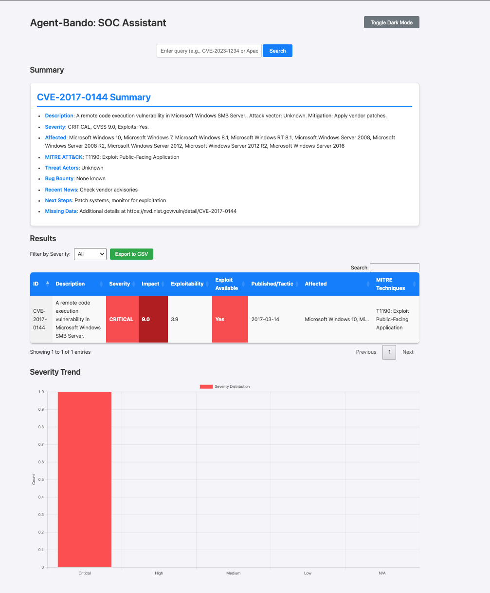
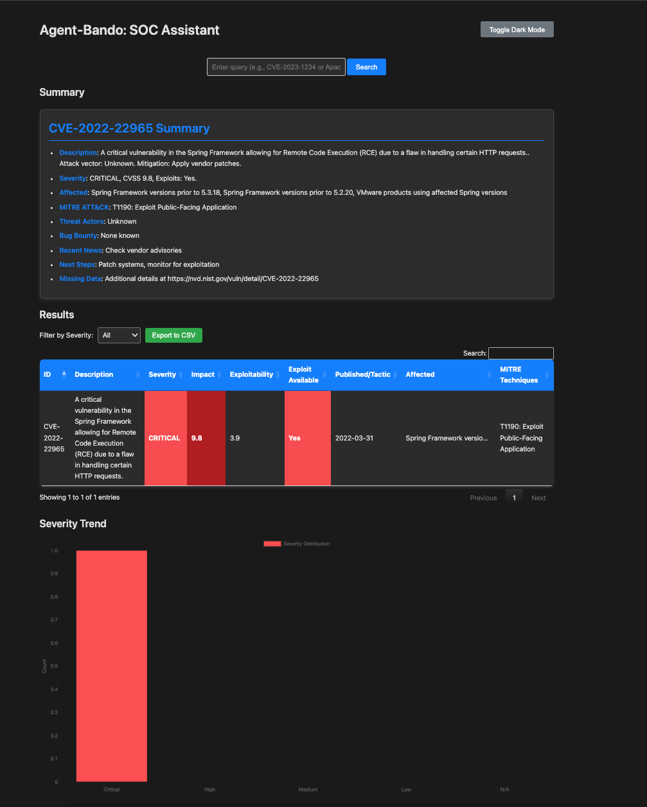

# Agent-Bando: Dynamic CVE Lookup Web App

**Agent-Bando** is a sleek and powerful Flask-based web application designed for Security Operations Centers (SOCs) to query Common Vulnerabilities and Exposures (CVEs) with ease. Powered by the meta-llama/Llama-4-Maverick api, Agent-Bando delivers dynamic tables and comprehensive summaries for CVEs like `CVE-2025-30400` and `CVE-2024-6387`, providing critical details such as severity, affected products, MITRE ATT&CK techniques, and actionable next steps.

It has Dark Mode too 😆

---

 

 
<!-- Placeholder; replace with actual screenshot -->

## Features

- **Dynamic CVE Queries**: Enter a CVE ID (e.g., `CVE-2025-30400`) to instantly retrieve detailed vulnerability data.
- **Interactive Table**: Displays key fields like `Severity`, `Impact`, `Exploitability`, `Affected Products`, and `MITRE Techniques`, with tooltips for affected products.
- **Rich Summaries**: Generates Markdown-rendered summaries with:
  - Vulnerability description and attack vector
  - Severity and exploit details
  - Affected products and vendors
  - MITRE ATT&CK mappings
  - Threat actors, bug bounties, recent news, and SOC next steps
- **Llama-Powered**: Leverages the `meta-llama/Llama-4-Maverick-17B-128E-Instruct-FP8` model via Together API for real-time data extraction. (Feel free to use the Deepseek model too)
- **Robust Fallback**: Gracefully handles API failures with minimal data and NVD links.
- **Logging**: Detailed logs in `agent_bando.log` for debugging and monitoring.

## Project Structure

```
agent-bando/
├── agent.py              # Core logic: Processes CVE queries via DeepSeek API
├── main.py               # Flask app: Serves the web UI
├── templates/
│   └── index.html        # UI: Renders table and summary
├── static/
│   └── style.css         # Styling: Table and summary formatting
├── utils/
│   └── logger.py         # Logging: Outputs to agent_bando.log
├── .env                  # Config: Stores TOGETHER_API_KEY
├── agent_bando.log       # Log file: Query and API response details
└── requirements.txt      # Dependencies: together, python-dotenv
```


## Prerequisites

- Python 3.8+
- A Together API key (sign up at [Together AI](https://www.together.ai/))

## Installation

1. **Clone the Repository**:
   ```bash
   git clone https://github.com/your-username/agent-bando.git
   cd agent-bando
   ```

2. **Set Up a Virtual Environment**:
   ```bash
   python -m venv venv
   source venv/bin/activate  # On Windows: venv\Scripts\activate
   ```

3. **Install Dependencies**:
   ```bash
   pip install -r requirements.txt
   ```

4. **Configure Environment**:
   Create a `.env` file in the project root:
   ```bash
   echo "TOGETHER_API_KEY=your-together-api-key" > .env
   ```

## Usage

1. **Run the App**:
   ```bash
   python main.py
   ```

2. **Access the Web UI**:
   Open `http://localhost:5001` in your browser.

3. **Query CVEs**:
   - Enter a CVE ID (e.g., `CVE-2025-30400`) in the search bar.
   - View the dynamic table with fields like `Severity`, `Affected`, and `MITRE Techniques`.
   - Read the detailed summary below, rendered as HTML with sections for description, mitigation, and SOC actions.
   - Use the severity filter or export results to CSV.

4. **Check Logs**:
   Review `agent_bando.log` for query details, API responses, and errors.

## Example Output

**Query**: `CVE-2025-30400`

**Table**:
| ID             | Description                             | Severity | Impact  | Exploitability | Exploit Available | Published  | Affected                                    | MITRE Techniques                         |
|----------------|-----------------------------------------|----------|---------|----------------|-------------------|------------|---------------------------------------------|------------------------------------------|
| CVE-2025-30400 | Memory corruption in network packets... | **High** | **7.8** | 1.8            | **No**            | 2025-02-11 | Cisco IOS XE, Juniper Junos OS, Fortinet... | T1203: Exploitation for Client Execution |

**Summary**:

***CVE-2025-30400 Summary***
- **Description**: Memory corruption vulnerability in network packets... Attack vector: Malformed packets. Mitigation: Apply vendor patches.
- **Severity**: CVSS 7.8, no known exploits.
- **Affected**: Cisco IOS XE, Juniper Junos OS, Fortinet FortiOS, ...
- **MITRE ATT&CK**: T1203: Exploitation for Client Execution
- **Threat Actors**: None known
- **Bug Bounty**: None
- **Recent News**: Vendor advisories issued
- **Next Steps**: Patch systems, monitor network traffic
- **Missing Data**: Threat actor details


## Troubleshooting

- **Incomplete Summaries**:
  - Check `agent_bando.log` for `Full API response` and `Raw summary`.
  - Ensure `TOGETHER_API_KEY` is valid in `.env`.
  - Test API:
    ```bash
    python -c "from together import Together; client = Together(api_key='your_key'); print(client.completions.create(model='meta-llama/Llama-4-Maverick-17B-128E-Instruct-FP8', prompt='For CVE-2025-30400, provide Markdown and JSON...', max_tokens=500).choices[0].text)"
    ```

- **Table Issues**:
  - Log `Parsed table data` in `agent_bando.log` to verify JSON fields.
  - Clear browser cache (`Ctrl+Shift+R`).

- **Dependencies**:
  - Reinstall:
    ```bash
    pip install together==1.4.6 python-dotenv==0.19.0 flask==2.2.5 markdown==3.4.1
    ```.

## License

This project is licensed under the MIT License. See the [LICENSE](LICENSE) file for details.
