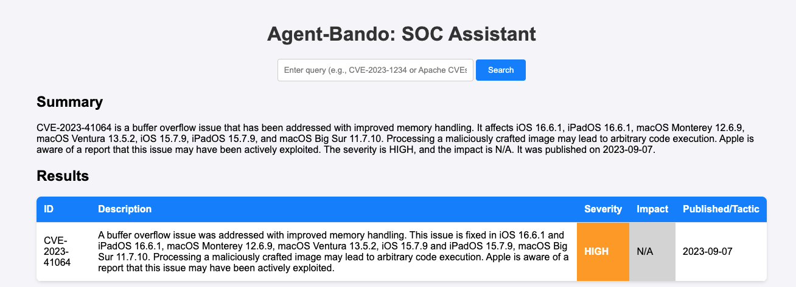
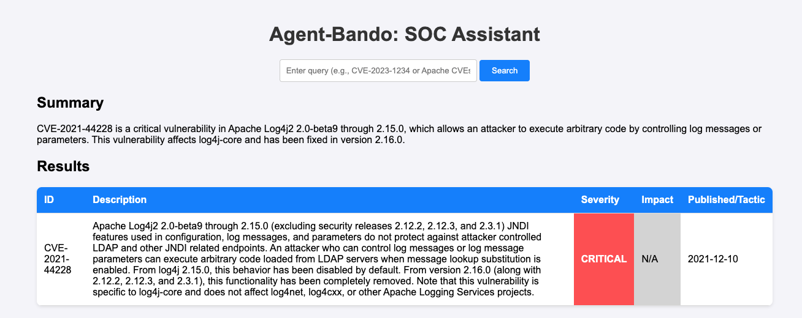

# Agent-Bando: Lightweight SOC Agent

Agent-Bando is a super lightweight, chat-based Security Operations Center (SOC) agent designed for basic querying of vulnerability data from open-source databases like the NIST National Vulnerability Database (NVD). Built with Together AI for natural language processing and Flask for a user-friendly web interface, it delivers concise, actionable insights in a color-coded table format, highlighting severity and impact. Perfect for quick CVE lookups, Agent-Bando is simple, efficient, and extensible.

## Features
- **Query Vulnerabilities**: Fetch details for specific CVEs (e.g., `CVE-2023-41064`) or search by keywords (e.g., `Apache`).
- **Color-Coded Table**: Displays CVE ID, description, severity, impact, and publication date with visual cues (e.g., red for Critical severity).
- **LLM Summaries**: Generates clear, actionable summaries using Together AI's `deepseek-ai/DeepSeek-V3` $0.20 per 1 million tokens
- **Lightweight & Extensible**: Modular design for easy integration of additional data sources (e.g., MITRE ATT&CK).
- **Rate-Limit Friendly**: Handles NIST API limits with delays, no API key required for basic use.

## Screenshots
### Summary Output and Result Table






## Prerequisites
- Python 3.8+
- A Together AI API key (sign up at [together.ai](https://www.together.ai/))

## Installation
1. **Clone the Repository**:
   ```bash
   git clone https://github.com/your-username/agent-bando.git
   cd agent-bando
   ```

2. **Set Up a Virtual Environment**:
   ```bash
   python -m venv venv
   source venv/bin/activate  # On Windows: venv\Scripts\activate
   ```

3. **Install Dependencies**:
   ```bash
   pip install -r requirements.txt
   ```

4. **Configure Environment**:
   Create a `.env` file in the project root:
   ```
   TOGETHER_API_KEY=your_together_ai_key
   ```
   Replace `your_together_ai_key` with your Together AI API key (no quotes).

## Usage
1. **Run the Application**:
   ```bash
   python main.py
   ```
   The app runs on `http://localhost:5001` (port 5001 avoids macOS ControlCenter conflicts).

2. **Access the Web Interface**:
   - Open `http://localhost:5001` in your browser.
   - Enter a query (e.g., `Show CVE-2023-41064` or `Apache CVEs`).
   - View the summary and color-coded table.

3. **Example Queries**:
   - `CVE-2023-41064`: Fetches details for a WebKit vulnerability.
   - `Apache`: Searches for recent Apache-related CVEs.
   - `T1234`: Placeholder for MITRE ATT&CK techniques (extendable).

## Troubleshooting
- **Empty Table**: Check `agent_bando.log` for NIST API errors (e.g., 429 Rate Limit). Increase `time.sleep` in `nist.py` or add an API key.
- **Port Conflict**: If port 5001 is in use, change to 5002 in `main.py` (`app.run(port=5002)`).
- **LLM Errors**: Verify Together AI API key and credits at [together.ai](https://www.together.ai/).

## Contributing
Contributions are welcome! Please:
1. Fork the repository.
2. Create a feature branch (`git checkout -b feature-name`).
3. Submit a pull request with clear descriptions.

## Acknowledgments
- [NIST NVD](https://nvd.nist.gov/) for open-source CVE data.
- [Together AI](https://www.together.ai/) for LLM capabilities.
- [Flask](https://flask.palletsprojects.com/) for the web framework.